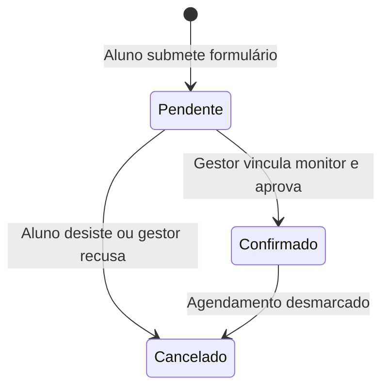
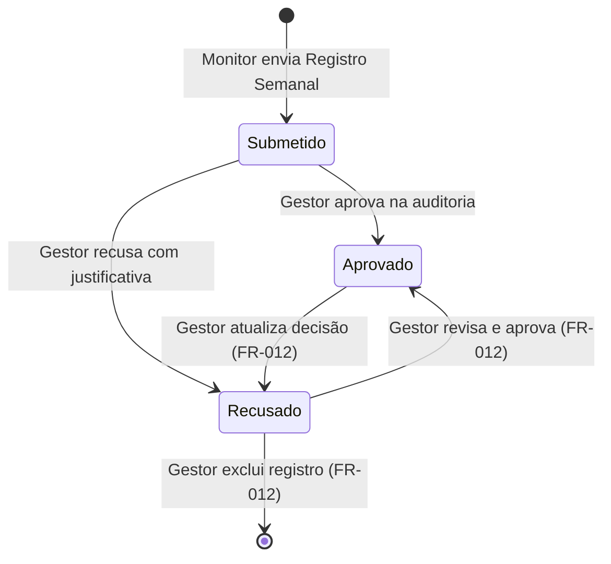

# Data Model: LampexControl System

Este documento especifica o esquema de dados do banco de dados relacional PostgreSQL do LampexControl, mapeando tabelas, tipos, restrições e relacionamentos.

---

## 1. Tabelas e Relacionamentos

### A. Tabela `monitor`
Armazena as informações dos voluntários e bolsistas do laboratório.

```sql
CREATE TABLE monitor (
    id UUID PRIMARY KEY DEFAULT gen_random_uuid(),
    nome TEXT NOT NULL,
    email TEXT UNIQUE NOT NULL,
    senha_hash TEXT NOT NULL,
    telefone TEXT NOT NULL,
    permite_exibir_contato BOOLEAN NOT NULL DEFAULT FALSE,
    plataforma_contato TEXT CHECK (plataforma_contato IN ('WhatsApp', 'Discord', 'Telegram', 'Outro')),
    matriz_disponibilidade JSONB NOT NULL DEFAULT '{}'::jsonb,
    role TEXT NOT NULL DEFAULT 'monitor' CHECK (role IN ('monitor', 'gestor')),
    created_at TIMESTAMP WITH TIME ZONE DEFAULT NOW()
);
```

### B. Tabela `solicitacao_monitoria`
Armazena chamados abertos por alunos para solicitar atendimento.

```sql
CREATE TABLE solicitacao_monitoria (
    id UUID PRIMARY KEY DEFAULT gen_random_uuid(),
    nome_aluno TEXT NOT NULL,
    email_aluno TEXT NOT NULL,
    telefone_aluno TEXT NOT NULL,
    cpf_aluno VARCHAR(11) NOT NULL CHECK (length(cpf_aluno) = 11),
    descricao_duvida TEXT NOT NULL,
    formato TEXT NOT NULL CHECK (formato IN ('Presencial', 'Online')),
    horarios_disponiveis JSONB NOT NULL,
    status TEXT NOT NULL DEFAULT 'Pendente' CHECK (status IN ('Pendente', 'Confirmado', 'Cancelado')),
    monitor_responsavel_id UUID REFERENCES monitor(id) ON DELETE SET NULL,
    created_at TIMESTAMP WITH TIME ZONE DEFAULT NOW()
);
```

### C. Tabela `registro_semanal`
Representa o envio unificado de atividades feitas por um monitor durante uma semana.

```sql
CREATE TABLE registro_semanal (
    id UUID PRIMARY KEY DEFAULT gen_random_uuid(),
    monitor_id UUID NOT NULL REFERENCES monitor(id) ON DELETE CASCADE,
    semana_referencia DATE NOT NULL,
    arquivo_pdf_url TEXT NOT NULL,
    created_at TIMESTAMP WITH TIME ZONE DEFAULT NOW(),
    CONSTRAINT unique_semana_monitor UNIQUE (monitor_id, semana_referencia)
);
```

### D. Tabela `item_atividade`
Representa as atividades individuais associadas a um registro semanal de horas.

```sql
CREATE TABLE item_atividade (
    id UUID PRIMARY KEY DEFAULT gen_random_uuid(),
    registro_semanal_id UUID NOT NULL REFERENCES registro_semanal(id) ON DELETE CASCADE,
    tipo_atividade TEXT NOT NULL CHECK (tipo_atividade IN ('Monitoria', 'Minicurso com Material', 'Minicurso sem Material', 'Marketing Digital', 'Desenvolvimento', 'Outros')),
    horas_brutas NUMERIC(4,2) NOT NULL CHECK (horas_brutas > 0),
    horas_liquidas NUMERIC(4,2) NOT NULL,
    evidencia_url TEXT NOT NULL,
    created_at TIMESTAMP WITH TIME ZONE DEFAULT NOW()
);
```

### E. Tabela `historico_auditoria`
Registra as ações de aprovação ou rejeição realizadas pela equipe de gestão, permitindo alteração e exclusão conforme regras de negócio definidas (FR-012).

```sql
CREATE TABLE historico_auditoria (
    id UUID PRIMARY KEY DEFAULT gen_random_uuid(),
    registro_semanal_id UUID NOT NULL REFERENCES registro_semanal(id) ON DELETE CASCADE,
    gestor_id UUID NOT NULL REFERENCES monitor(id),
    status_auditoria TEXT NOT NULL CHECK (status_auditoria IN ('Aprovado', 'Recusado')),
    justificativa TEXT NOT NULL,
    data_hora_acao TIMESTAMP WITH TIME ZONE DEFAULT NOW()
);
```

---

## 2. Regras de Negócio e Triggers (PostgreSQL)

### A. Cálculo Automatizado de Horas Líquidas
Uma Trigger BEFORE INSERT OR UPDATE na tabela `item_atividade` calcula e atualiza o valor de `horas_liquidas` automaticamente (FR-005):

```sql
CREATE OR REPLACE FUNCTION calcular_horas_liquidas()
RETURNS TRIGGER AS $$
BEGIN
    CASE NEW.tipo_atividade
        WHEN 'Monitoria' THEN
            NEW.horas_liquidas := NEW.horas_brutas * 2.0;
        WHEN 'Minicurso com Material' THEN
            NEW.horas_liquidas := NEW.horas_brutas * 3.0;
        WHEN 'Minicurso sem Material' THEN
            NEW.horas_liquidas := NEW.horas_brutas * 2.5;
        WHEN 'Marketing Digital' THEN
            -- Marketing Digital calcula com base fixa na descrição:
            -- Se for estruturação de perfil (4h), se for post comum (2h)
            -- Exemplo simplificado baseado no input:
            IF NEW.horas_brutas = 1.0 THEN
                NEW.horas_liquidas := 2.0; -- 2 horas por post (Story/Reel/Feed)
            ELSE
                NEW.horas_liquidas := 4.0; -- 4 horas para melhoria de perfil
            END IF;
        ELSE
            -- Desenvolvimento / Outros: carga líquida definida de acordo com o bruto (1:1 por padrão ou parametrizado)
            NEW.horas_liquidas := NEW.horas_brutas;
    END CASE;
    RETURN NEW;
END;
$$ LANGUAGE plpgsql;

CREATE TRIGGER trg_calcular_horas_liquidas
BEFORE INSERT OR UPDATE ON item_atividade
FOR EACH ROW
EXECUTE FUNCTION calcular_horas_liquidas();
```

### B. Trava de Reuniões Gerais
As horas correspondentes a reuniões gerais de planejamento comum não devem acumular horas líquidas (devem ser forçadas a 0.0 na computação, a menos que marcadas manualmente pela gestão) (FR-006):

```sql
CREATE OR REPLACE FUNCTION aplicar_trava_reunioes()
RETURNS TRIGGER AS $$
BEGIN
    -- Se a atividade for classificada como 'Outros' e for uma reunião comum
    -- de planejamento geral, as horas líquidas são travadas em 0.0
    IF NEW.tipo_atividade = 'Outros' AND NEW.evidencia_url ILIKE '%planejamento%' THEN
        NEW.horas_liquidas := 0.0;
    END IF;
    RETURN NEW;
END;
$$ LANGUAGE plpgsql;

CREATE TRIGGER trg_trava_reunioes
BEFORE INSERT OR UPDATE ON item_atividade
FOR EACH ROW
EXECUTE FUNCTION aplicar_trava_reunioes();
```

---

## 3. Transições de Estado




