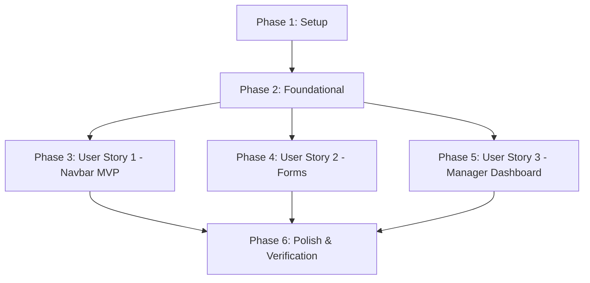

# Tasks: Responsividade e Adequação Mobile (Mobile-First)

**Input**: Design documents from `/specs/006-responsive-mobile-ui/`

**Prerequisites**: plan.md (required), spec.md (required), research.md, data-model.md, contracts/ui-design-contract.md

**Tests**: Tests are not explicitly requested in the feature specification, so no separate test automation tasks are generated. Manual verification scenarios are defined in quickstart.md.

**Organization**: Tasks are grouped by user story to enable independent implementation and testing of each story.

## Format: `[ID] [P?] [Story] Description`

- **[P]**: Can run in parallel (different files, no dependencies)
- **[Story]**: Which user story this task belongs to (e.g., US1, US2, US3)
- All descriptions include exact file paths.

---

## Phase 1: Setup (Shared Infrastructure)

**Purpose**: Project initialization and basic responsive setup

- [x] T001 Adjust default viewport metadata in [index.html](file:///C:/Users/josue/OneDrive/Documentos/Jramso/Node/Ts/LampexControl/lampex-control/index.html) to ensure correct mobile scaling and zoom behaviors.
- [x] T002 Configure global CSS variables for touch targets (e.g., `--touch-target-min: 44px`) and add a reset for horizontal overflow (`overflow-x: hidden`) on body/html in [style.css](file:///C:/Users/josue/OneDrive/Documentos/Jramso/Node/Ts/LampexControl/lampex-control/src/style.css).

---

## Phase 2: Foundational (Blocking Prerequisites)

**Purpose**: Core UI layout variables and helper classes that must be complete before any user story is implemented

**⚠️ CRITICAL**: No user story work can begin until this phase is complete.

- [x] T003 Define global responsive utility classes for mobile card containers and fluid paddings under `@media (max-width: 768px)` in [style.css](file:///C:/Users/josue/OneDrive/Documentos/Jramso/Node/Ts/LampexControl/lampex-control/src/style.css).
- [x] T004 Setup a unified button sizing class helper in [style.css](file:///C:/Users/josue/OneDrive/Documentos/Jramso/Node/Ts/LampexControl/lampex-control/src/style.css) to ensure all `.btn-primary` and `.btn-secondary` instances default to at least 44px height.

**Checkpoint**: Foundation ready - user story implementation can now begin.

---

## Phase 3: User Story 1 - Navegação Responsiva no Mobile (Priority: P1) 🎯 MVP

**Goal**: Implement a mobile-responsive navbar with a hamburger menu in App.vue for screen widths below 768px.

**Independent Test**: Emulate mobile display (< 768px). The horizontal navigation links must be hidden, and a hamburger icon button must be visible. Tapping the hamburger button must toggle the vertical visibility of the navigation links.

### Implementation for User Story 1

- [x] T005 [P] [US1] Create the reactive menu state `isMenuOpen = ref(false)` and path toggle listeners inside `<script setup>` of [App.vue](file:///C:/Users/josue/OneDrive/Documentos/Jramso/Node/Ts/LampexControl/lampex-control/src/App.vue).
- [x] T006 [US1] Add the hamburger toggle button markup and update the mobile menu link layout list inside `<template>` of [App.vue](file:///C:/Users/josue/OneDrive/Documentos/Jramso/Node/Ts/LampexControl/lampex-control/src/App.vue).
- [x] T007 [US1] Add styles, transitions, and media-queries to handle hamburger layout and mobile navigation links list toggling in [style.css](file:///C:/Users/josue/OneDrive/Documentos/Jramso/Node/Ts/LampexControl/lampex-control/src/style.css).

**Checkpoint**: User Story 1 is fully functional. The site can be navigated normally in mobile view.

---

## Phase 4: User Story 2 - Acesso e Cadastro Simplificados no Mobile (Priority: P1)

**Goal**: Make login and candidate registration forms responsive, fluid, and touch-friendly on mobile screens.

**Independent Test**: Load `/login` and registration views in mobile mode. Verify cards expand to fill screen margins fluidly, inputs stack in 1 column, and form components are at least 44px tall.

### Implementation for User Story 2

- [x] T008 [P] [US2] Convert inline fixed pixel widths, margins, and paddings to fluid percentages and responsive variables in [Login.vue](file:///C:/Users/josue/OneDrive/Documentos/Jramso/Node/Ts/LampexControl/lampex-control/src/pages/Login.vue).
- [x] T009 [P] [US2] Ensure the email input, password input, and submission button meet the 44px height requirement in [Login.vue](file:///C:/Users/josue/OneDrive/Documentos/Jramso/Node/Ts/LampexControl/lampex-control/src/pages/Login.vue).
- [x] T010 [P] [US2] Update [CadastroMonitor.vue](file:///C:/Users/josue/OneDrive/Documentos/Jramso/Node/Ts/LampexControl/lampex-control/src/components/CadastroMonitor.vue) grid columns (`responsive-grid-2`) to stack vertically under 768px, and make the card container padding fluid.
- [x] T011 [P] [US2] Adjust input, select box, and candidate form action button heights to minimum 44px in [CadastroMonitor.vue](file:///C:/Users/josue/OneDrive/Documentos/Jramso/Node/Ts/LampexControl/lampex-control/src/components/CadastroMonitor.vue).

**Checkpoint**: User Story 2 is complete. Monitor login and candidate registration are fully mobile-friendly.

---

## Phase 5: User Story 3 - Visualização Responsiva do Painel do Gestor (Priority: P2)

**Goal**: Make the manager dashboard tabs, candidate triagem panel, and audit panel fully responsive on viewports below 768px.

**Independent Test**: Log in as a gestor, resize to mobile. The candidate table must switch to a card list layout with clear touch targets. The audit panel PDF visualizer iframe must disappear and be replaced by a functional "Open PDF in New Tab" button.

### Implementation for User Story 3

- [x] T012 [P] [US3] Adapt tab navigation button layout in [ManagerDashboard.vue](file:///C:/Users/josue/OneDrive/Documentos/Jramso/Node/Ts/LampexControl/lampex-control/src/pages/ManagerDashboard.vue) to wrap or overflow scroll smoothly on small screens.
- [x] T013 [US3] Add a mobile-first list container with vertical layout cards (`
`) mirroring candidate data (name, matricula, curso, etc.) in [TriagemPanel.vue](file:///C:/Users/josue/OneDrive/Documentos/Jramso/Node/Ts/LampexControl/lampex-control/src/components/TriagemPanel.vue).
- [x] T014 [US3] Integrate media queries in [TriagemPanel.vue](file:///C:/Users/josue/OneDrive/Documentos/Jramso/Node/Ts/LampexControl/lampex-control/src/components/TriagemPanel.vue) styling to show the card list and hide the traditional `<table>` element below 768px, ensuring touch targets for Approve/Reject are >= 44px.
- [x] T015 [US3] Refactor layout grids in [AuditPanel.vue](file:///C:/Users/josue/OneDrive/Documentos/Jramso/Node/Ts/LampexControl/lampex-control/src/components/AuditPanel.vue) to stack list and detail views vertically under 768px, and apply styling rules to hide the PDF `iframe` wrapper on mobile.
- [x] T016 [US3] Implement an alternative external link button ("Abrir Relatório em Nova Aba") in [AuditPanel.vue](file:///C:/Users/josue/OneDrive/Documentos/Jramso/Node/Ts/LampexControl/lampex-control/src/components/AuditPanel.vue) targeting the PDF URL that is visible only on screens smaller than 768px.

**Checkpoint**: User Story 3 is complete. The coordinator dashboard is completely operational on mobile and tablet viewports.

---

## Phase 6: Polish & Cross-Cutting Concerns

**Purpose**: Quality checks, final adjustments, and validation

- [x] T017 [P] Audit all views (Home, WeeklySubmission, MonitorProfile, RequestStatus) to confirm zero horizontal page overflow and scrollbars under all viewport sizes.
- [x] T018 Confirm that the institutional color contrast (green `#008744`, red `#d62d20`) and interactive button focus states render correctly across major mobile browser emulations.
- [x] T019 Run and complete all validation scenarios documented in the [quickstart.md](file:///C:/Users/josue/OneDrive/Documentos/Jramso/Node/Ts/LampexControl/lampex-control/specs/006-responsive-mobile-ui/quickstart.md) guide.

---

## Dependencies & Execution Order

### Phase Dependencies

* **Setup (Phase 1)**: Can start immediately.
* **Foundational (Phase 2)**: Depends on Setup. Blocks implementation of all user stories.
* **User Stories (Phases 3, 4, 5)**: All depend on Foundational completion. They can be implemented sequentially or in parallel.
* **Polish (Phase 6)**: Depends on completion of all implementation phases.

### Parallel Opportunities
* Setup tasks (T001, T002) can run in parallel.
* Foundational tasks (T003, T004) can run in parallel.
* Once Phase 2 is complete, User Story 1 (T005-T007), User Story 2 (T008-T011), and User Story 3 (T012-T016) can be developed concurrently since they touch different Vue pages and components.
* Polishing and validation tasks can be executed independently.

---

## Implementation Strategy

### MVP First (User Story 1 Only)
1. Initialize the layout variables and CSS constraints (Phase 1 & Phase 2).
2. Refactor the header navigation in `App.vue` (Phase 3 - US1).
3. **Validate**: Test mobile navigation on a real phone or emulator. This yields a viable MVP where the application is navigatable.

### Incremental Delivery
1. Deliver the MVP navigation bar.
2. Deliver the responsive forms for Login and Cadastro (US2) to allow seamless user registration on mobile.
3. Deliver the coordinator dashboard adjustments (US3) to support mobile coordinator workflows.
4. Execute full device validation (Phase 6).
