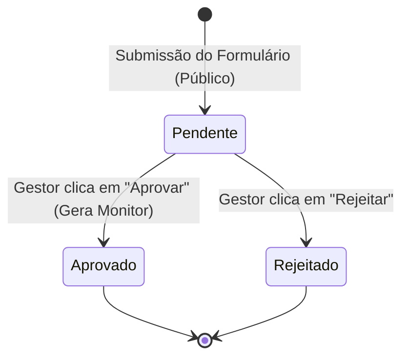

# Data Model: Fluxo de Triagem de Voluntários

## Entity Schema

### 1. Potencial Voluntário (`potencial_voluntario`)

Representa um candidato a monitor registrado no sistema na etapa pública de cadastro de triagem.

| Column | Type | Constraints | Description |
|---|---|---|---|
| `id` | UUID | PRIMARY KEY, DEFAULT `gen_random_uuid()` | Identificador único do candidato |
| `nome` | TEXT | NOT NULL | Nome completo do candidato |
| `email` | TEXT | UNIQUE, NOT NULL | Endereço de e-mail do candidato (para login futuro) |
| `cpf` | TEXT | UNIQUE, NOT NULL | CPF do candidato (higienizado, apenas números) |
| `telefone` | TEXT | NOT NULL | Telefone de contato (higienizado) |
| `curso` | TEXT | NOT NULL | Nome do curso de graduação/técnico |
| `matricula` | TEXT | UNIQUE, NOT NULL | Matrícula acadêmica do Ifes |
| `origem_cadastro` | TEXT | NOT NULL, CHECK (see below) | Como conheceu o projeto Lampex |
| `status_aprovacao` | TEXT | NOT NULL, DEFAULT 'Pendente', CHECK (see below) | Status do fluxo de triagem |
| `created_at` | TIMESTAMPTZ | DEFAULT `NOW()` | Data/Hora de envio da ficha |

#### Restrições CHECK (Constraints)

- **`origem_cadastro`**: Deve pertencer estritamente ao conjunto:
  - `'Instagram'`
  - `'Youtube'`
  - `'Professores ou colegas de turma'`
  - `'Membros da Equipe Executora do Projeto Lampex'`
  - `'Avisos do Ifes'`
- **`status_aprovacao`**: Deve pertencer ao conjunto:
  - `'Pendente'`
  - `'Aprovado'`
  - `'Rejeitado'`

### 2. Monitor (`monitor` - Tabela Existente)

Representa o membro ativo do LAMPEX. Detalhes de colunas relevantes para a migração:

| Column | Type | Description |
|---|---|---|
| `id` | UUID | Identificador herdado ou gerado (Chave Primária) |
| `nome` | TEXT | Nome completo do monitor (copiado de `potencial_voluntario.nome`) |
| `email` | TEXT | E-mail do monitor (copiado de `potencial_voluntario.email`, serve como usuário de login) |
| `senha_hash` | TEXT | Senha criptografada por `crypt` com `gen_salt('bf')` baseada no formato `Lampex@<matricula>` |
| `telefone` | TEXT | Telefone do monitor (copiado de `potencial_voluntario.telefone`) |
| `permite_exibir_contato` | BOOLEAN | Padrão `FALSE` pós-migração |
| `plataforma_contato` | TEXT | Nulo por padrão pós-migração |
| `matriz_disponibilidade` | JSONB | Padrão `'{}'::jsonb` |
| `role` | TEXT | Definido como `'monitor'` |
| `created_at` | TIMESTAMPTZ | Data e hora de criação |

---

## State Diagram & Transitions

O status de aprovação de um candidato segue a máquina de estados abaixo:

- **Pendente**: Estado inicial após criação via `POST /api/voluntarios/cadastro`.
- **Aprovado**: Estado final após a ação do gestor. Desencadeia a criação do registro na tabela `monitor` com `role = 'monitor'`.
- **Rejeitado**: Estado final após descarte do gestor.
