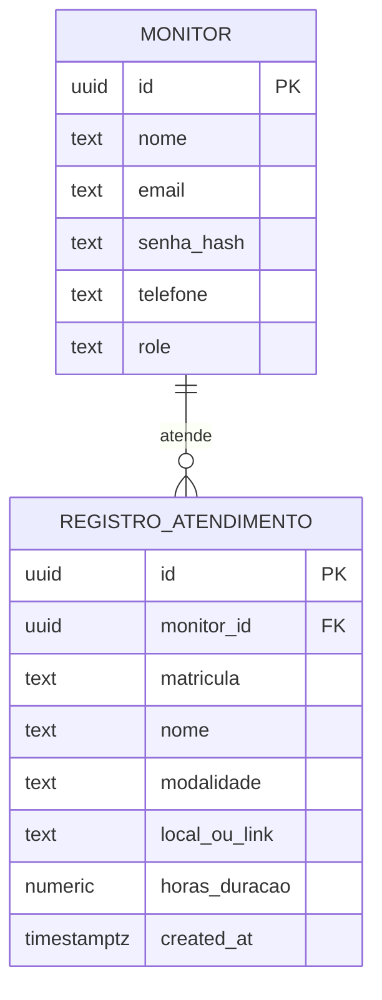

# Data Model: Validação de Atendimentos via QR Code

Este documento define o modelo de dados e as restrições de persistência para os registros de atendimento no banco de dados PostgreSQL.

## Diagrama Entidade-Relacionamento (Conceitual)

## Definições das Entidades

### Entidade: `Registro de Atendimento` (Tabela `registro_atendimento`)

Armazena as validações de monitoria/atendimento submetidas pelos alunos após a leitura do QR Code.

| Campo | Tipo | Restrições | Descrição |
|---|---|---|---|
| `id` | `UUID` | `PRIMARY KEY`, `DEFAULT gen_random_uuid()` | Identificador único do registro de atendimento. |
| `monitor_id` | `UUID` | `REFERENCES monitor(id) ON DELETE SET NULL` | ID do monitor que realizou o atendimento. Nullable caso o monitor seja removido. |
| `matricula` | `TEXT` | `NOT NULL` | Número de matrícula do aluno atendido. |
| `nome` | `TEXT` | `NOT NULL` | Nome completo do aluno atendido. |
| `modalidade` | `TEXT` | `NOT NULL`, `CHECK (modalidade IN ('Presencial', 'Online'))` | Modalidade em que o atendimento foi realizado. |
| `local_ou_link` | `TEXT` | `NOT NULL` | Sala/laboratório físico (para Presencial) ou URL da sala virtual (para Online). |
| `horas_duracao` | `NUMERIC(4,2)` | `NOT NULL`, `CHECK (horas_duracao > 0)` | Duração real do atendimento em horas (suporta decimais, ex: 1.5). |
| `created_at` | `TIMESTAMP WITH TIME ZONE` | `NOT NULL`, `DEFAULT NOW()` | Carimbo de data/hora do registro de validação. |

## Regras de Validação do Modelo

1. **Modalidade e Local/Link**:
   - A modalidade deve ser estritamente `'Presencial'` ou `'Online'`.
   - Se a modalidade for `'Online'`, o campo `local_ou_link` deve conter uma URL válida (verificada no frontend, e salva como texto no banco).
   - Se a modalidade for `'Presencial'`, o campo `local_ou_link` deve indicar o local físico (ex: "Laboratório 3").
2. **Duração**:
   - As horas devem ser informadas e ser estritamente maiores que zero (`CHECK (horas_duracao > 0)`).
3. **Segurança Referencial**:
   - Quando um monitor é deletado da tabela `monitor`, os seus registros de atendimento relacionados na tabela `registro_atendimento` passam a ter o campo `monitor_id = NULL`, mantendo as informações e somas de consumo dos alunos para auditorias históricas.
