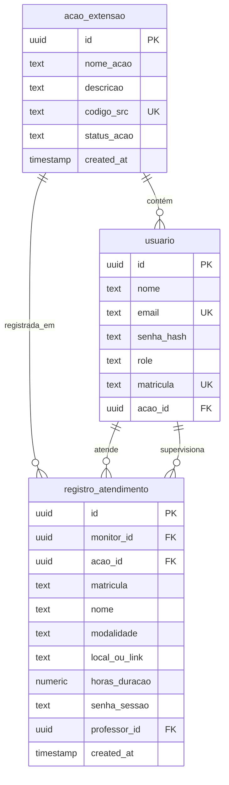

# Data Model: Plataforma de Governança de Ações de Extensão

## 1. Diagrama de Relacionamentos (Lógico)



## 2. Entidades & Campos

### A. Ação de Extensão (`acao_extensao`)
- `id` (UUID, PK): Identificador único da Ação de Extensão.
- `nome_acao` (TEXT, NOT NULL): Nome amigável do projeto ou ação de extensão.
- `descricao` (TEXT): Descrição longa ou objetivos da ação.
- `codigo_src` (TEXT, UNIQUE, NOT NULL): Código de controle identificador para o SRC.
- `status_acao` (TEXT, NOT NULL, DEFAULT 'Ativa'): Indica se a ação está ativa ('Ativa', 'Inativa').
- `created_at` (TIMESTAMP WITH TIME ZONE): Data/hora de registro.

### B. Usuário (`usuario`)
- Modificação: Adição do campo `acao_id` (UUID, NULL, FK -> `acao_extensao(id)` ON DELETE SET NULL).
- Indica a qual projeto ou ação de extensão o voluntário ou professor está associado.

### C. Registro de Atendimento (`registro_atendimento`)
- Modificação 1: Adição do campo `acao_id` (UUID, NOT NULL, FK -> `acao_extensao(id)` ON DELETE RESTRICT).
- Modificação 2: Adição do campo `senha_sessao` (TEXT, NULL) para armazenar a senha digitada/utilizada na monitoria com professor.
- Modificação 3: Adição do campo `professor_id` (UUID, NULL, FK -> `usuario(id)` ON DELETE SET NULL) para rastrear o professor supervisor daquela sessão de atendimento.

---

## 3. Roteiro de Migração SQL (PostgreSQL Aiven)

```sql
-- Criar a tabela acao_extensao
CREATE TABLE IF NOT EXISTS acao_extensao (
    id UUID PRIMARY KEY DEFAULT gen_random_uuid(),
    nome_acao TEXT NOT NULL,
    descricao TEXT,
    codigo_src TEXT NOT NULL UNIQUE,
    status_acao TEXT NOT NULL DEFAULT 'Ativa' CHECK (status_acao IN ('Ativa', 'Inativa')),
    created_at TIMESTAMP WITH TIME ZONE DEFAULT NOW()
);

-- Inserir ação de extensão padrão para dados legados
INSERT INTO acao_extensao (nome_acao, codigo_src, descricao)
VALUES ('Ação de Extensão Padrão', 'PADRAO', 'Ação criada automaticamente para migração de histórico')
ON CONFLICT (codigo_src) DO NOTHING;

-- Modificar a tabela usuario para associar a acao_extensao
ALTER TABLE usuario ADD COLUMN IF NOT EXISTS acao_id UUID REFERENCES acao_extensao(id) ON DELETE SET NULL;

-- Associar usuários existentes (voluntarios e professores) à ação padrão se necessário
UPDATE usuario SET acao_id = (SELECT id FROM acao_extensao WHERE codigo_src = 'PADRAO') WHERE acao_id IS NULL AND role IN ('voluntario', 'professor');

-- Modificar a tabela registro_atendimento
-- 1. Adicionar acao_id temporariamente permitindo nulos para migração
ALTER TABLE registro_atendimento ADD COLUMN IF NOT EXISTS acao_id UUID REFERENCES acao_extensao(id) ON DELETE RESTRICT;

-- 2. Atualizar atendimentos legados com a ação padrão
UPDATE registro_atendimento SET acao_id = (SELECT id FROM acao_extensao WHERE codigo_src = 'PADRAO') WHERE acao_id IS NULL;

-- 3. Tornar o acao_id obrigatório (NOT NULL)
ALTER TABLE registro_atendimento ALTER COLUMN acao_id SET NOT NULL;

-- 4. Adicionar as colunas adicionais para monitoria com professor
ALTER TABLE registro_atendimento ADD COLUMN IF NOT EXISTS senha_sessao TEXT;
ALTER TABLE registro_atendimento ADD COLUMN IF NOT EXISTS professor_id UUID REFERENCES usuario(id) ON DELETE SET NULL;

-- Criar índices de performance adicionais
CREATE INDEX IF NOT EXISTS idx_usuario_acao_id ON usuario(acao_id);
CREATE INDEX IF NOT EXISTS idx_registro_atendimento_acao_id ON registro_atendimento(acao_id);
CREATE INDEX IF NOT EXISTS idx_registro_atendimento_professor_id ON registro_atendimento(professor_id);
```
